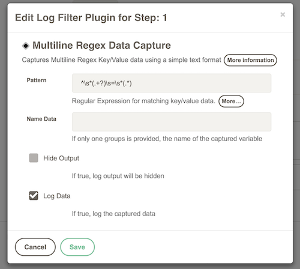
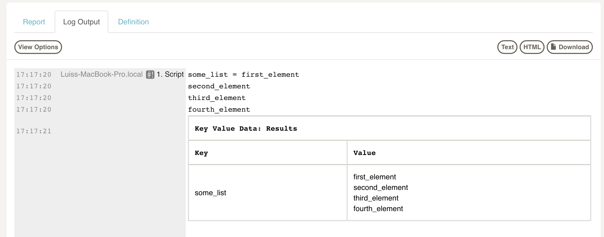
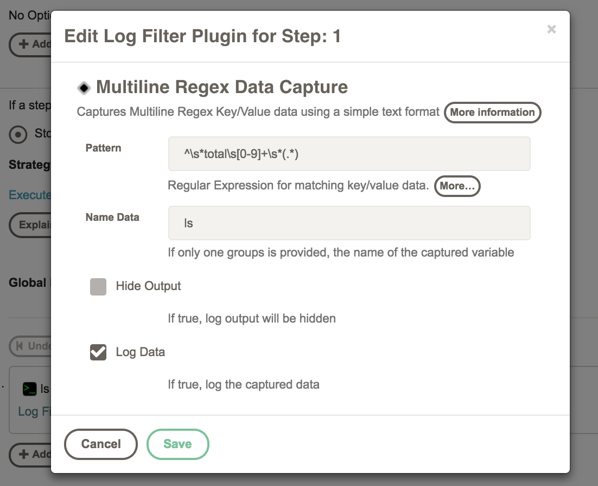
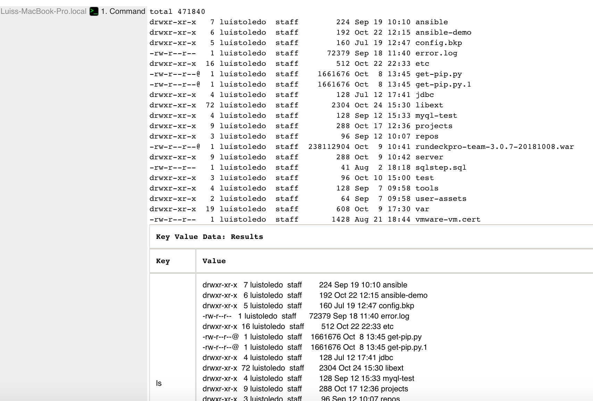
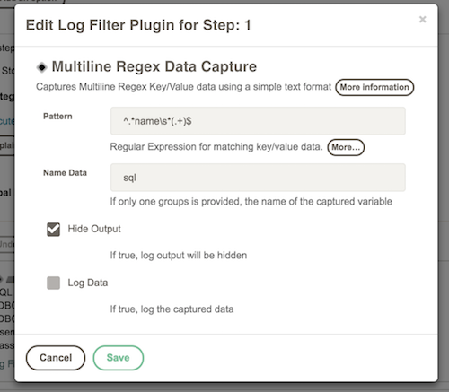
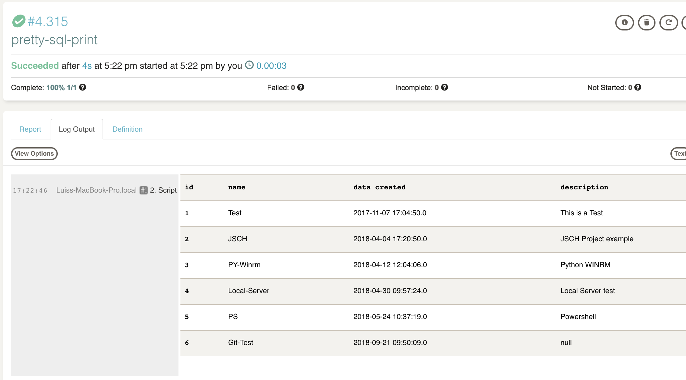

# Multiline Regex Data Capture

This plugin captures Multiline Regex Key/Value data using a simple text format from a regular expression. 

## Build

```
gradle clean install
```

## Install

```
cp build/lib/multiline-regex-datacapture-filter-X.X.X.jar $RDECKBASE/libext
```

## How to use

* Add a global o a step `Multiline Regex Data Capture` filter
* Set the regex pattern to use, eg `^(.+?)\s*=\s*(.+)`
* Set a name data (optional). If the pattern does not capture a key value, this parameter is required (example 2)
* You can hide the original log output (checking the flag `Hide Output`)
* You can print the result of the match (checking the flag `Log Data`)

## Examples

* Example 1: Capture a key/value list (see [examples/iterate-a-list.xml](examples/iterate-a-list.xml))

    
                


* Example 2: Capture the result of a `ls -l` command (see [examples/capture-ls-command.xml](examples/capture-ls-command.xml))





* Example 3: Capture the result of a SQL query and iterate the captured variable using another step  (see [examples/capture-ls-command.xml](examples/pretty-sql-print.xml))





