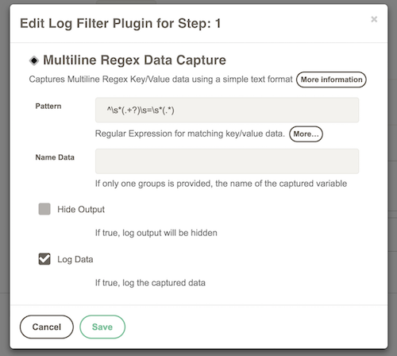
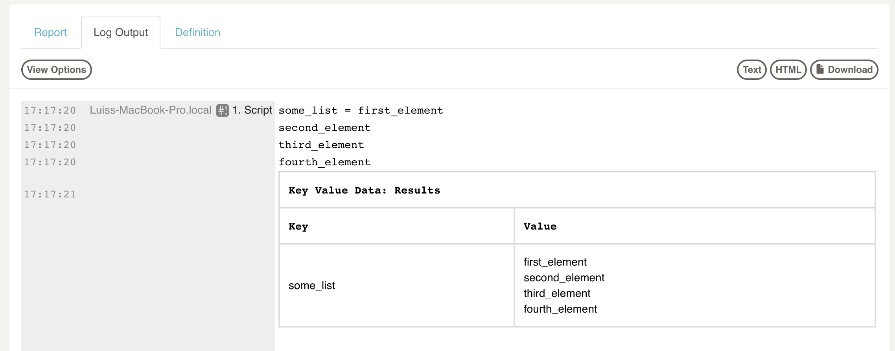
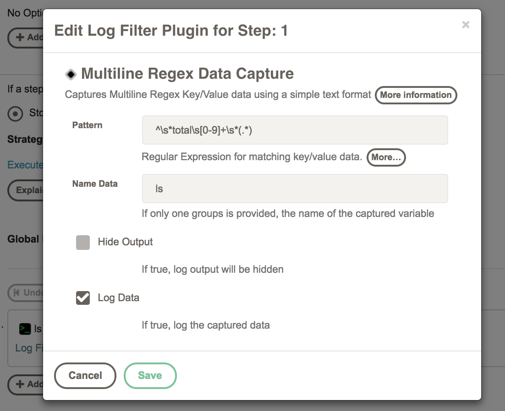
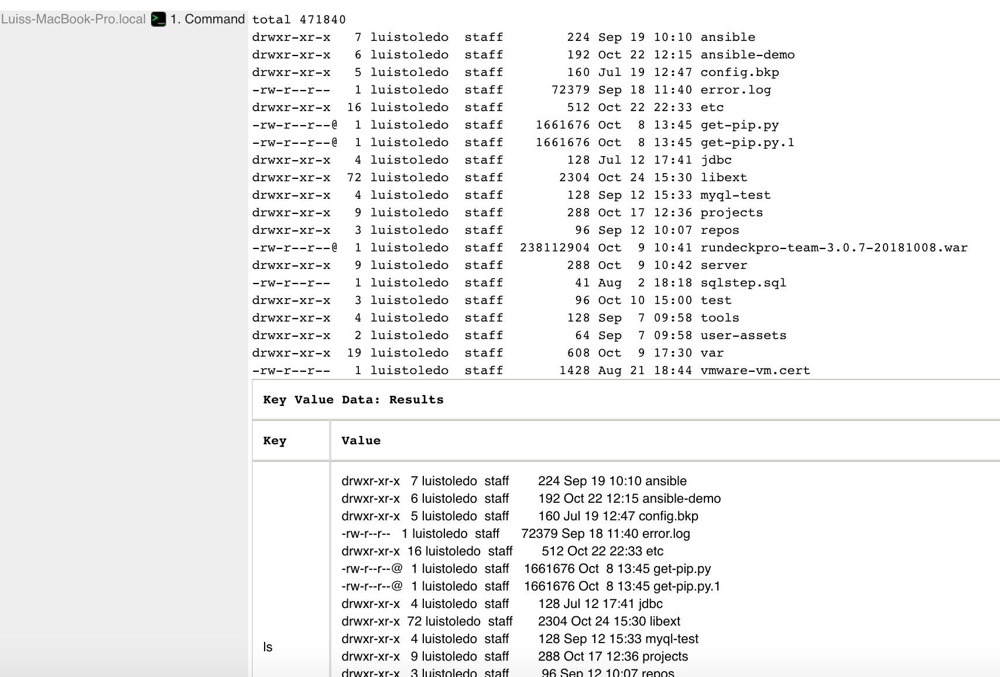
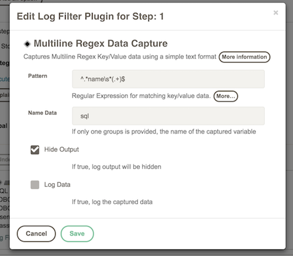
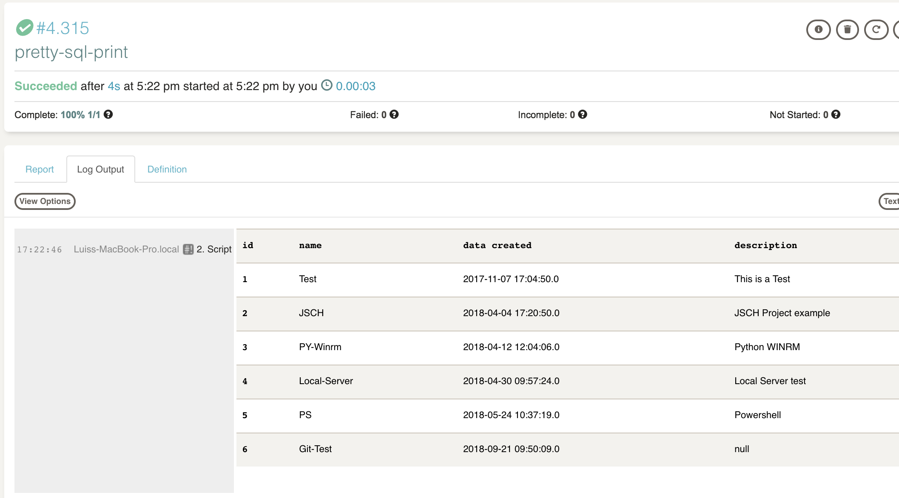

# Multiline Regex Data Capture

This plugin captures Multiline Regex Key/Value data using a simple text format from a regular expression. 

## Requirements

- **Java**: 11 or later
- **Gradle**: 8.x (included via Gradle Wrapper)
- **Rundeck**: 5.16.0 or later
- **Groovy**: 4.0.x (automatically managed by Gradle)

## Build

To build this plugin from source:

```bash
# Clean and build the plugin
./gradlew clean build

# The built JAR will be available in build/libs/
```

### Development Requirements

For development, ensure you have:
- JDK 11 or later installed
- Git for version control

## Install

### From Release

1. Download the latest release JAR from the [releases page](../../releases)
2. Copy the JAR to your Rundeck plugins directory:
   ```bash
   cp multiline-regex-datacapture-filter-X.X.X.jar $RUNDECK_HOME/libext/
   ```
3. Restart Rundeck

### From Source

After building the plugin:

```bash
# Copy the built JAR to Rundeck's plugin directory
cp build/libs/multiline-regex-datacapture-filter-*.jar $RUNDECK_HOME/libext/

# Restart Rundeck to load the plugin
```

**Note**: Replace `$RUNDECK_HOME` with your actual Rundeck installation directory (typically `/var/lib/rundeck` on Linux or the installation directory on other systems).

## How to use

* Add a global o a step `Multiline Regex Data Capture` filter
* Set the regex pattern to use, eg `^(.+?)\s*=\s*(.+)`
* Set a name data (optional). If the pattern does not capture a key value, this parameter is required (example 2)
* You can hide the original log output (checking the flag `Hide Output`)
* You can print the result of the match (checking the flag `Log Data`)

## Examples

* Example 1: Capture a key/value list (see [examples/iterate-a-list.xml](examples/iterate-a-list.xml))

    
                


* Example 2: Capture the result of a `ls -l` command (see [examples/capture-ls-command.xml](examples/capture-ls-command.xml))





* Example 3: Capture the result of a SQL query and iterate the captured variable using another step  (see [examples/capture-ls-command.xml](examples/pretty-sql-print.xml))





## Testing

Run the test suite:

```bash
./gradlew test
```

## Contributing

1. Fork the repository
2. Create a feature branch (`git checkout -b feature/amazing-feature`)
3. Make your changes
4. Ensure tests pass (`./gradlew test`)
5. Ensure the build works (`./gradlew build`)
6. Commit your changes (`git commit -am 'Add amazing feature'`)
7. Push to the branch (`git push origin feature/amazing-feature`)
8. Open a Pull Request

## License

This project is licensed under the terms specified in the [LICENSE](LICENSE) file.

## Security

This project uses automated security scanning via Snyk to identify and address potential vulnerabilities in dependencies.